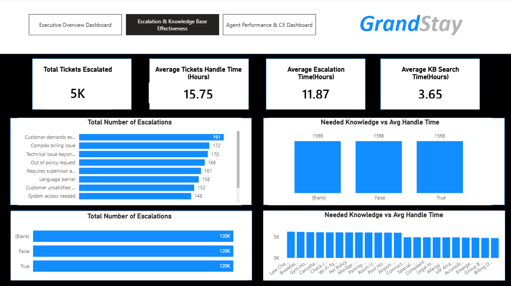

<div class="hero">
# Intelligent Service Analytics & Decision Support

## Research & Applied Analytics Project

### Abstract

This project investigates how service-operation data can be used to identify process, knowledge and automation opportunities that may improve service-level performance and customer experience.

The analysis examined operational service information, including escalation patterns, service performance and agent/customer-experience indicators, with the objective of identifying areas where data-driven interventions and automation could improve service delivery.

The project identified opportunities that were projected to reduce SLA breaches by approximately **30%** and improve CSAT by approximately **20%**.

Beyond its immediate operational objectives, the project provides a foundation for further investigation into predictive analytics, intelligent systems and AI-assisted decision support.

**Research areas:** Artificial Intelligence · Intelligent Systems · Predictive Analytics · Decision Support · Process Analytics · Automation

---

# 1. Introduction

Modern service organisations generate substantial amounts of operational data through customer interactions, service requests, escalations, service-level monitoring and agent activities.

Although organisations commonly use dashboards and reports to monitor these activities, descriptive reporting primarily explains what has already happened.

A more advanced approach is to use operational data to identify emerging risks and support proactive decision-making.

This project investigates how service analytics can be used as a foundation for moving from descriptive reporting towards intelligent service decision support.

---

# 2. Problem Statement

Service organisations can experience SLA breaches and declining customer satisfaction because of a combination of factors, including process inefficiencies, knowledge gaps, escalation patterns and limitations in existing workflows.

Identifying these factors manually can be difficult when service information is distributed across multiple operational activities.

The problem addressed by this project is therefore:

> **How can service-operation data be analysed to identify process, knowledge and automation opportunities that can support improved service-level performance and customer experience?**

A further research direction arising from this work is whether historical service data could be used to predict service-level risks before they occur.

---

# 3. Research Motivation

The project was motivated by the need to move beyond simply reporting service performance.

Rather than only asking:

> "How many SLA breaches occurred?"

the analysis considers questions such as:

- What patterns are associated with service escalation?
- Where are process weaknesses occurring?
- Where do knowledge gaps exist?
- Which activities could potentially be automated?
- How could operational data support earlier intervention?
- Could historical service information eventually be used to predict SLA risk?

These questions provide a bridge between traditional business intelligence and intelligent decision-support systems.

---

# 4. Project Objectives

The objectives of the project were to:

1. Analyse service-operation information.
2. Identify patterns associated with service escalations.
3. Investigate potential causes of SLA breaches.
4. Identify process and knowledge gaps.
5. Identify opportunities for automation.
6. Analyse agent-performance and customer-experience indicators.
7. Develop recommendations for improving service operations.
8. Explore how the analysis could be extended into predictive and intelligent decision support.

---

# 5. Analytical Approach

The project followed a structured analytical process:

```text
Service Operation Data
          ↓
Data Preparation
          ↓
Exploratory Analysis
          ↓
Service Performance Analysis
          ↓
Escalation Analysis
          ↓
Process & Knowledge Gap Identification
          ↓
Automation Opportunities
          ↓
Decision-Support Opportunities

6. Service Performance Analysis

Service-level performance was examined to identify areas where operational processes could be improved.

The analysis considered service-performance indicators and escalation patterns to understand where service delivery was experiencing difficulties.

The objective was not simply to report the number of incidents, but to identify opportunities for intervention.

This included examining:

Service-level performance
Escalation patterns
Agent performance
Customer-experience indicators
Process-related issues
Knowledge-related issues
Potential automation opportunities
7. Escalation Analysis

Escalations provide an important indicator of potential weaknesses within a service process.

Analysing escalation patterns can help identify:

Repeated service issues
Process bottlenecks
Knowledge gaps
Cases requiring specialist intervention
Opportunities for earlier intervention
Escalation Dashboard


The dashboard was used to investigate service escalation patterns and identify areas where operational intervention could potentially reduce service-level risks.

8. Agent Performance & Customer Experience

Agent-level and customer-experience information was also considered as part of the analysis.

Understanding the relationship between operational performance and customer experience can help organisations identify opportunities for:

Process improvement
Training
Knowledge management
Workflow optimisation
Automation
Agent Performance & Customer Experience Dashboard


The analysis provided an operational view of agent performance and customer-experience indicators.

9. Executive Service Analytics

An executive-level dashboard was developed to provide a consolidated view of important service-performance indicators.

Executive Dashboard


The dashboard provides a high-level view that can support management-level interpretation of service performance and improvement opportunities.

10. Process Improvement Opportunities

The analysis identified opportunities across several areas.

Process

Potential process improvements included identifying activities where existing workflows could be simplified, standardised or redesigned.

Knowledge

The analysis highlighted opportunities to improve access to relevant information and reduce knowledge-related barriers to effective service delivery.

Automation

Certain repetitive or structured activities presented opportunities for automation.

Automation can potentially reduce manual effort while allowing staff to focus on more complex service issues.

11. Project Outcomes

The analysis identified improvement opportunities that were projected to:

Reduce SLA breaches by approximately 30%
Improve CSAT by approximately 20%

These figures represent the projected impact associated with the identified improvement opportunities.

They should not be interpreted as experimentally established causal effects unless the recommendations were subsequently implemented and measured using an appropriate evaluation methodology.

12. From Descriptive Analytics to Intelligent Decision Support

One of the most important research directions emerging from this project is the transition from descriptive analytics to predictive and intelligent systems.

A traditional dashboard can answer:

What happened?

An analytical system can investigate:

Why did it happen?

A predictive system could potentially answer:

What is likely to happen next?

An intelligent decision-support system could go further:

What action should be considered?

This progression can be represented as:

Descriptive Analytics
        ↓
What happened?
        ↓
Diagnostic Analytics
        ↓
Why did it happen?
        ↓
Predictive Analytics
        ↓
What is likely to happen?
        ↓
Decision Support
        ↓
What action should be considered?
This transition represents the principal research direction arising from the project.

13. Proposed Predictive Analytics Extension

A future extension of this project could investigate whether historical service-operation data can be used to predict the probability of an SLA breach.

A conceptual system could operate as follows:

New Service Request
        ↓
Relevant Service Features
        ↓
Predictive Model
        ↓
SLA Risk Score
        ↓
Low / Medium / High Risk
        ↓
Recommended Intervention

Potential features could include service characteristics, historical escalation information, service complexity and other variables available within an appropriate dataset.

These features would need to be established empirically rather than assumed.

14. Potential Machine Learning Approaches

If suitable historical labelled data becomes available, potential predictive approaches could include:

Logistic Regression
Decision Trees
Random Forest
Gradient Boosting
XGBoost

The models could be compared using appropriate evaluation measures.

Potential evaluation metrics include:

Precision
Recall
F1-score
ROC-AUC
Confusion Matrix

The choice of metric should reflect the operational consequences of incorrectly classifying a service request as high or low risk.

15. Explainable AI Extension

Predicting that a service request is at high risk is not necessarily sufficient for an operational decision-maker.

The user may also need to understand:

Why has the system identified this request as high risk?

This creates an opportunity to investigate explainable artificial intelligence.

Potential techniques such as SHAP could be investigated to identify the variables contributing to individual predictions.

A future decision-support interface could therefore present:

SLA Risk: HIGH

Primary contributing factors:
• Factor A
• Factor B
• Factor C

Suggested intervention:
Escalate / Prioritise / Assign specialist

16. Proposed Research Questions

The current project provides several possible directions for future research.

Research Question 1

Can historical service-operation data be used to predict the probability of SLA breaches?

Research Question 2

Which operational factors contribute most significantly to SLA-breach risk?

Research Question 3

Can explainable machine-learning models provide useful information for proactive service-management decisions?

Research Question 4

Can intelligent decision-support systems improve the effectiveness of human service-management decisions?

These questions would require further empirical investigation.

17. Proposed Research Hypotheses

A potential future study could investigate the following hypothesis:

H1: Machine-learning models can identify service requests at increased risk of SLA breach using historical service-operation data.

A second hypothesis could investigate explainability:

H2: Explainable machine-learning models can identify operational factors that provide useful information for proactive service-management decisions.

A further study could investigate whether decision support improves operational outcomes:

H3: AI-assisted decision support can improve service-management outcomes compared with conventional dashboard-based monitoring.

The hypotheses would need to be tested experimentally.

18. Potential Experimental Design

A future study could follow this structure:

Historical Service Data
          ↓
Data Cleaning
          ↓
Feature Engineering
          ↓
Training / Validation / Test Split
          ↓
Baseline Model
          ↓
Machine Learning Models
          ↓
Model Evaluation
          ↓
Explainability Analysis
          ↓
Decision-Support Prototype
          ↓
Operational Evaluation

The baseline model would provide a reference point against which more complex approaches could be compared.

19. Human-AI Decision Support

An important consideration for this research direction is that the objective should not necessarily be to replace human service managers or agents.

Instead, AI could be used to augment human decision-making.

For example:

AI System
   ↓
Risk Assessment
   ↓
Explanation
   ↓
Recommendation
   ↓
Human Decision
   ↓
Operational Action

This human-in-the-loop approach could be particularly valuable where service decisions require contextual knowledge or professional judgement.

20. Limitations

The current project has several limitations.

First, the work primarily focused on operational analytics and identifying improvement opportunities.

Second, the projected improvements of approximately 30% in SLA breaches and 20% in CSAT have not been presented as controlled experimental results.

Third, a predictive machine-learning model has not been claimed unless it has actually been trained and evaluated using suitable historical data.

Fourth, the generalisability of the findings would need to be established using data from additional service environments.

21. Future Research

Potential future research directions include:

SLA-breach prediction.
Intelligent service-request classification.
Automated escalation prediction.
Explainable AI for service management.
AI-assisted knowledge recommendation.
Intelligent service-desk assistants.
Human-AI decision support.
Real-time service-risk monitoring.
Large language models for service operations.
Evaluation of AI-assisted decision-making in operational environments.
22. Research Significance

This project demonstrates how operational service analytics can be used to move beyond conventional reporting towards intelligent decision support.

The work connects practical data analytics with research areas including:

Artificial Intelligence
Machine Learning
Predictive Analytics
Explainable AI
Intelligent Systems
Decision Support
Process Automation

The project therefore provides a practical foundation for further research into AI systems that assist organisations in identifying operational risks and making evidence-based decisions.

23. Technologies

The project involved analytical dashboards and data-driven investigation of service operations.

Technologies and analytical approaches used in the project included:

Data Analytics
Dashboard Development
Business Intelligence
Operational Analytics
Service Performance Analysis
Process Analysis

Future predictive extensions could investigate Python and machine-learning frameworks where appropriate.

24. Project Status

Current status: Applied service analytics project with proposed predictive analytics, machine-learning and intelligent decision-support extensions.

The published project documents the analytical work completed to date while identifying potential directions for future empirical research.
