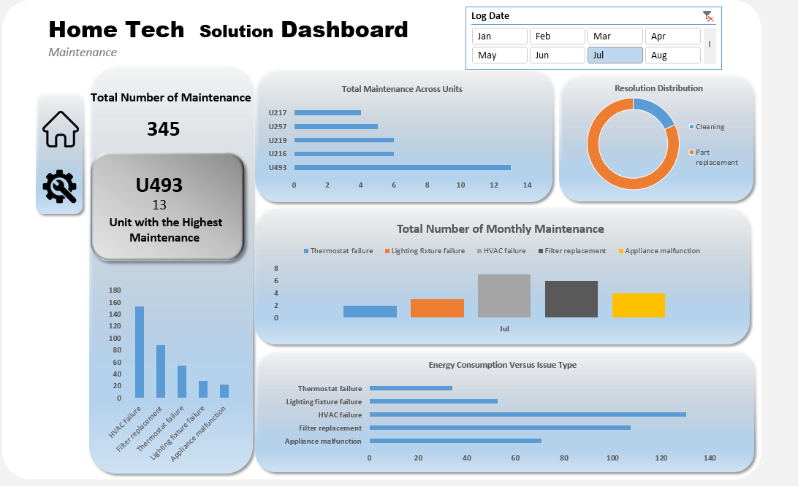
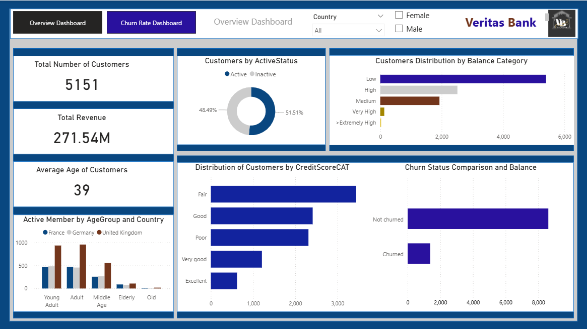
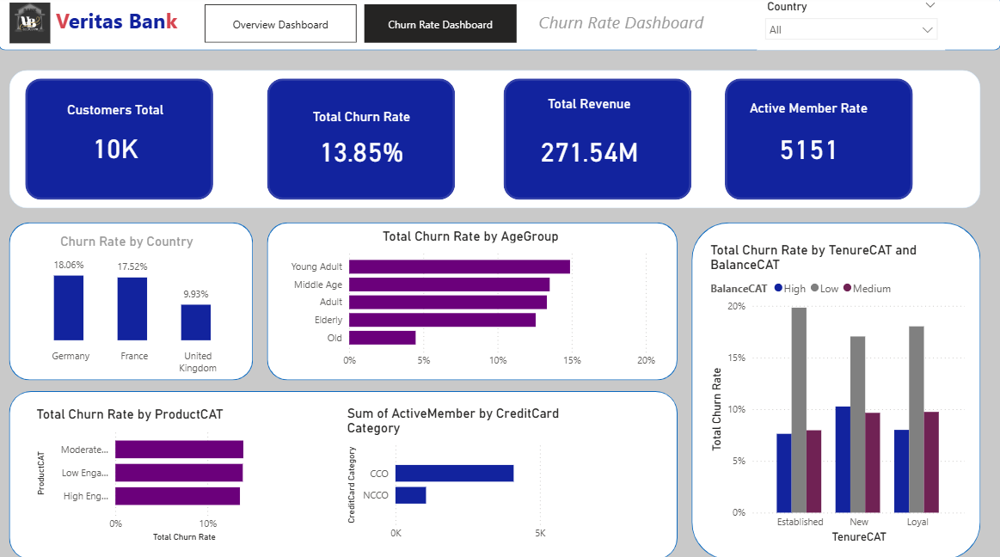
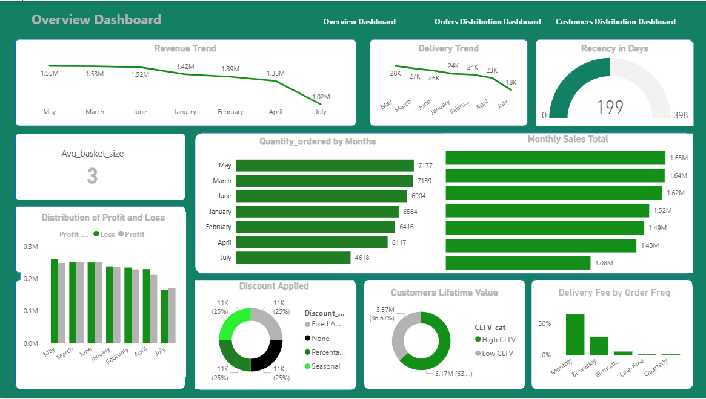
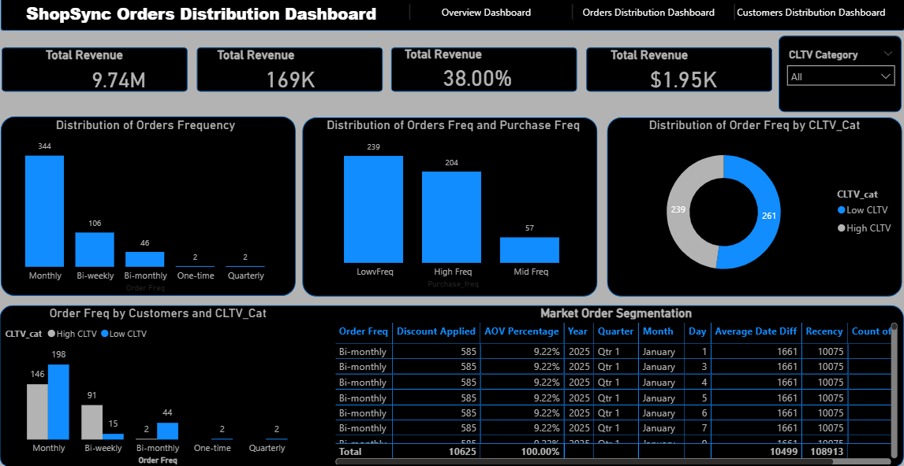
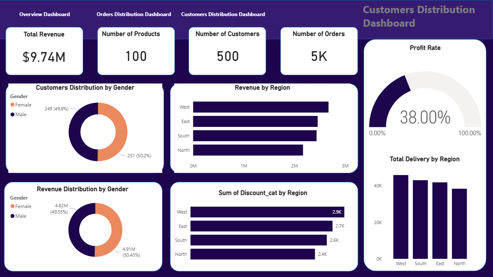

<!--Section 1: Introduce your self-->
## ABOUT ME

Hello! I’m **Kayode Omotayo** 👋  
A **Data Analyst** with over **6 years of experience** transforming complex datasets into actionable business and operational insights.

I’ve worked across **healthcare, schools, engineering, technology, and consulting**, supporting stakeholders with accurate, compliant, and decision-driven analytics. My strengths lie in combining technical analysis with clear communication, automation, and documentation.

---

<!--Mention your top/relevant skills here - core and soft skills-->
## SKILLS

**Data Analysis, Automation & Reporting**

- ✅ Build scalable dashboards and reports using **Power BI, SQL, and Excel**
- ✅ Automate ETL pipelines to improve efficiency and data reliability
- ✅ Deliver predictive and statistical analysis using **Python**
- ✅ Support data governance, documentation, and compliance
- ✅ Translate complex data into clear insights for non-technical stakeholders

---

## TECHNICAL SKILLS

**Languages & Tools:**  
SQL, Python, Power BI, Tableau, Excel, Databricks, Apache Spark  

**Cloud & Platforms:**  
Azure (ADF, Synapse), AWS, MongoDB, Talend, Airflow, IBM Cognos  

**Analytics & Methods:**  
ETL Pipelines, Data Modelling, Predictive Analytics, Statistical Analysis, Forecasting, Data Quality Management

---

<!--Section 2: List 3-4 key projects-->
## PROJECTS

*A glimpse of some of the projects I've been working on.*

**How I analyzed 71,966 kWh of sensor data and 354 maintenance records in Excel to identify HVAC and tenant behavior patterns, enabling targeted actions that improved energy efficiency and preventive maintenance planning across rental units by 33%.**

- [Read More](energy-usage-analysis.md)

**How Identified process, knowledge, and automation opportunities projected to reduce SLA breaches by 30% and improve CSAT by 20%.**

- [Read More](intelligent-travel-concierge-assistant.md)

**Led ~85% of customer churn analysis, SQL transformation, Power BI dashboards, and data-driven retention strategy development for Veritas Bank**

[Read More](customers-churn-and-Retention-analysis.md)

**Identified strategies to lift retention and purchase frequency, targeting up to 15% revenue growth through improved customer segmentation — ShopSync E-commerce**

[Read More](optimizing-customer-segmentation-and-sales-strategy.md)

## CONTACT DETAILS

*Let’s connect and see how we can make a difference together!*
<table>
  <tbody>
    <tr>
      <td>📧</td>
      <td><a href="mailto:omotayo.kayode@gmail.com">omotayo.kayode@gmail.com</a></td>
    </tr>
    <tr>
      <td>📞</td>
      <td>(234) 07565109926 </td>
    </tr>
    <tr>
      <td>📍</td>
      <td>Aberdeen, United Kingdom</td>
    </tr>
  
    <tr>
      <td>🌐</td>
      <td><a href="www.linkedin.com/in/kayodetheanalyst">The things I do daily on LinkedIn</a></td>
    </tr>
   
  </tbody>
</table>
