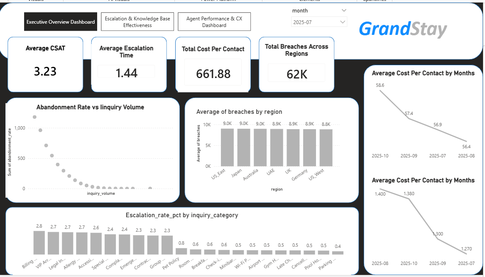
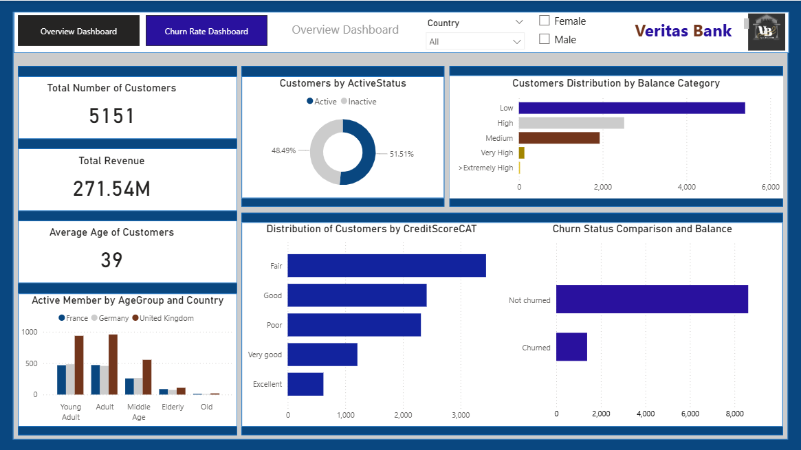
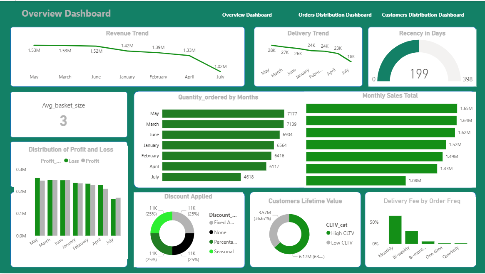

# Kayode Omotayo

## Computer Scientist | Data Analytics Consultant | Enterprise IT Professional | AI & Data Analytics Research Enthusiast

Transforming data into intelligent solutions through analytics, cloud technologies, and machine learning.

Over 15 years of experience across enterprise IT, healthcare technology, cloud platforms, and advanced analytics.

## ABOUT ME
I am a Computer Science graduate with over 15 years of professional experience spanning enterprise IT, healthcare technology, cloud computing, and advanced data analytics. Throughout my career, I have designed technology solutions that improve operational efficiency, automate business processes, and support data-driven decision making across education, healthcare, engineering, and consulting sectors. My professional experiences have inspired a strong interest in Artificial Intelligence, Machine Learning, and Intelligent Decision Support Systems, motivating me to pursue graduate research focused on developing scalable, data-driven solutions to real-world challenges.

## SKILLS

**Data Analysis, Automation & Reporting**

• Design and develop scalable dashboards using Power BI, SQL and Excel

• Develop automated ETL pipelines that improve data quality and reporting efficiency

• Apply Python for predictive modelling, statistical analysis and automation

• Implement data governance, documentation and quality assurance practices

• Communicate technical findings through clear visualisations and stakeholder-friendly reporting

## TECHNICAL SKILLS

Programming

Python
SQL

Business Intelligence

Power BI
Tableau
Excel

Big Data

Apache Spark
Databricks

Cloud

Azure
AWS

Databases

SQL Server
MongoDB

Data Engineering

Airflow
Talend
Azure Data Factory

Analytics

Predictive Analytics
Data Modelling
Forecasting
Statistical Analysis
Data Quality Management

---
## PROFESSIONAL EXPERIENCE

## Data Analytics Consultant | Amdari, United Kingdom
2025 – Present
Design and develop data analytics solutions using SQL, Python, Power BI, and cloud technologies.
Build interactive dashboards that support strategic decision-making.
Develop ETL pipelines and automate reporting workflows.
Conduct customer segmentation, predictive analytics, and business intelligence projects.
Deliver analytics solutions across multiple business domains.

Selected projects include:

Customer Churn Analysis (Veritas Bank),
HVAC Energy Consumption Analytics,
ShopSync Customer Segmentation,
Intelligent Service Desk Analytics,

## Laboratory IT Support Specialist / Data Support | NHS Grampian, Aberdeen, United Kingdom
2023 – 2024
Managed and maintained IT systems supporting pathology laboratories across NHS Grampian.
Supported laboratory computers, diagnostic analysers, sequencers, and other critical laboratory equipment to ensure high system availability.
Administered user accounts and access permissions for consultants, doctors, biomedical scientists, and laboratory staff.
Supported clinical applications including TrakCare, ICE, EMIS, and other NHS laboratory systems.
Investigated and resolved technical issues affecting laboratory operations and clinical reporting.
Monitored interfaces and connectivity to ensure laboratory results were transmitted accurately and without interruption.
Extracted and prepared data from the legacy Laboratory Information Management System (LIMS) to support migration to a new AWS-hosted LIMS.
Participated in testing and validation activities to verify the functionality, performance, and data integrity of the new LIMS before deployment.
Collaborated with multidisciplinary teams to maintain reliable laboratory IT services supporting patient care.

## Senior Technical Engineer | Fujitsu, United Kingdom
2022
Supported enterprise servers, network switches, and end-user infrastructure.
Configured and provisioned electoral devices used during the Orkney local government elections.
Diagnosed and resolved hardware, networking, and operating system issues.
Delivered technical support within strict operational service levels.

## IT Officer | Association for Consulting Engineering in Nigeria
2020 – 2021
Managed enterprise network infrastructure.
Administered Active Directory user accounts.
Supported Windows Server environments.
Maintained organisational IT infrastructure.
Implemented technical solutions that improved service delivery.

## IT Support Engineer | Britech Hallmark Limited, Nigeria
2018 – 2020
Managed corporate network infrastructure.
Administered Active Directory.
Installed and maintained computer systems.
Supported users and resolved technical issues.
Ensured network availability and system security.

## IT Support / Database Administrator | Corona Schools Trust Council, Nigeria
2013 – 2018
Managed the school's enterprise IT infrastructure.
Administered Windows Servers and Active Directory.
Managed school databases and information systems.
Designed, deployed, and administered the Moodle Virtual Learning Environment.
Managed the CCTV infrastructure.
Led IT projects from planning through implementation.
Managed departmental IT budgets.
Installed and configured hardware and software.
Administered teacher gradebook systems and student report card software.
Provided technical support for staff and students.
Ensured business continuity for all mission-critical systems.

## Mathematics and Computer Studies Teacher
Holy Infant College & Sky-Vision Schools
2010 – 2013
Taught Mathematics and Computer Studies to Senior Secondary School students.
Developed lesson plans and assessments.
Prepared students for national examinations.
Applied technology to enhance teaching and learning.

## Student Lecturer (NYSC)
Nuhu Bamalli Polytechnic
2009 – 2010
Taught National Diploma students:
Calculus
Introduction to Computer Science
Delivered lectures and tutorials.
Assessed coursework and examinations.
Supported students' academic development.

## EDUCATION
**B.Sc. Computer Science**
Adekunle Ajasin University, Nigeria
Second Class Upper Division
CGPA: 3.80/5.00
Graduated: 2009

## RESEARCH INTERESTS
- Artificial Intelligence
- Machine Learning
- Data Mining
- Explainable AI
- Healthcare Analytics
- Intelligent Decision Support Systems
- Cloud Computing
- Data Engineering
- Predictive Analytics
- Big Data Systems

## TECHNICAL WRITINGS
- Customer Churn Analysis using SQL and Power BI
- HVAC Energy Consumption Analytics
- Predictive Maintenance Dashboard
- Intelligent Service Desk Analytics

## PROJECTS

Machine Learning for HVAC Energy Consumption & Predictive Maintenance

Investigating whether sensor and maintenance data can be used to identify energy-consumption patterns and predict maintenance requirements.

Dataset: 71,966 kWh sensor records + 354 maintenance records
Methods: Exploratory analysis, feature engineering, predictive modelling
Tools: Python, Excel, Power BI
Research areas: Machine Learning · Predictive Maintenance · IoT Analytics

[Read Research Project →](energy-usage-analysis.md)

Intelligent Service Analytics & Decision Support
Investigating opportunities for automation and intelligent prediction of service-level risks.
Research areas: AI · Intelligent Systems · Explainable AI
[Read Project →](intelligent-travel-concierge-assistant.md)

Explainable Machine Learning for Customer Churn
Applying predictive modelling and explainable AI to customer retention.
Research areas: Machine Learning · Explainable AI · Predictive Analytics
[Read Project →](customers-churn-and-Retention-analysis.md)

Machine Learning-Based Customer Segmentation
Applying clustering and behavioural analysis to identify meaningful customer segments.
Research areas: Unsupervised Learning · Clustering · Customer Analytics
[Read Project →](optimizing-customer-segmentation-and-sales-strategy.md)

## PROFESSIONAL HIGHLIGHTS 
- 15+ years in Computing and Information Technology
- Worked in three countries
- Built analytical dashboards used for strategic decision making
- Automated reporting workflows using Python and SQL
- Experienced across healthcare, education, engineering and consulting
- Strong foundation in enterprise IT and cloud platforms
- Extensive stakeholder engagement and technical documentation

## FUTURE RESEARCH GOALS
My long-term research ambition is to develop Artificial Intelligence and Machine Learning models that improve decision support systems across healthcare, engineering, and public-sector organisations. I am particularly interested in scalable cloud-based analytics, explainable AI, and intelligent systems that enable evidence-based decision making. Beyond graduate study, I aspire to contribute to both academia and industry through impactful research, innovation, and collaborative partnerships.

## WHY GRADUATE RESEARCH
During my professional career, I have implemented enterprise IT solutions and developed analytics systems that improved operational efficiency and supported strategic decision making. These experiences have shown me both the potential and the limitations of current technologies, motivating me to pursue graduate research in Artificial Intelligence, Machine Learning, and Intelligent Decision Support Systems. Through an MSc in Computing Science, I aim to deepen my theoretical foundation, conduct impactful research, and develop scalable solutions to complex real-world challenges.

## CONTACT DETAILS

*Let’s connect and see how we can make a difference together!*
<table>
  <tbody>
    <tr>
      <td>📧</td>
      <td><a href="mailto:omotayo.kayode@gmail.com">omotayo.kayode@gmail.com</a></td>
    </tr>
    <tr>
      <td>📞</td>
      <td>(+44) 07565109926 </td>
    </tr>
    <tr>
      <td>📍</td>
      <td>Aberdeen, United Kingdom</td>
    </tr>
  
    <tr>
      <td>🌐</td>
      <td><a href="https://www.linkedin.com/in/kayodetheanalyst/">The things I do daily on LinkedIn</a></td>
    </tr>
   
  </tbody>
</table>
