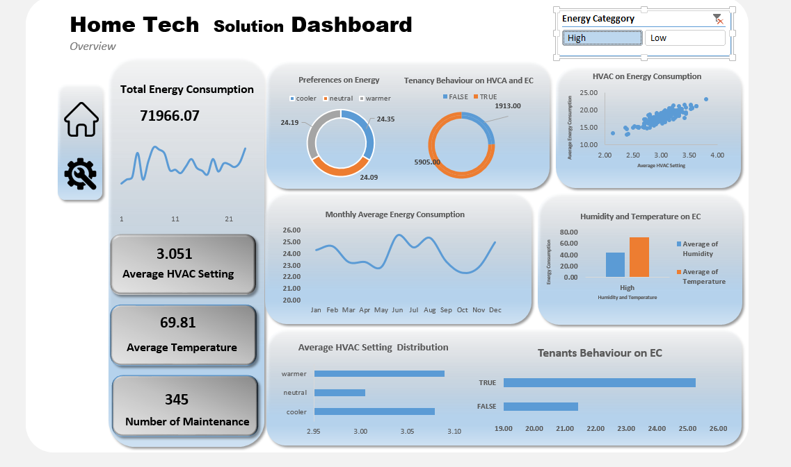
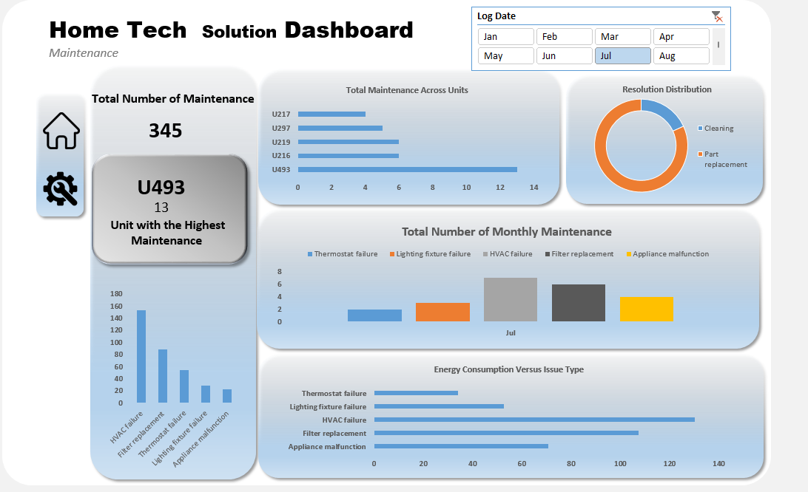

# Machine Learning for HVAC Energy Consumption and Predictive Maintenance

## Research & Applied Analytics Project

### Abstract

This project investigates energy consumption and maintenance patterns using HVAC sensor and maintenance data.

The analysis examined approximately **71,966 kWh of sensor data** and **354 maintenance records** to identify patterns in energy consumption, tenant behaviour, and maintenance activity.

The original analytical work was undertaken to support targeted energy-efficiency and preventive-maintenance planning. The project provides a foundation for further investigation into the application of machine learning to HVAC energy forecasting and predictive maintenance.

**Research areas:** Machine Learning · Predictive Maintenance · Energy Analytics · IoT Analytics · Data Analytics

---

## 1. Background

Heating, ventilation and air-conditioning (HVAC) systems can represent a significant component of building energy consumption.

Understanding how energy consumption relates to usage patterns, occupancy behaviour and maintenance activity can help organisations improve operational efficiency and plan maintenance more effectively.

This project examines historical sensor and maintenance information to identify patterns that may support more informed energy-management and maintenance decisions.

---

## 2. Research Problem

Traditional energy and maintenance analysis often relies on historical reporting and manual inspection of operational data.

A more proactive approach would use historical sensor and maintenance information to identify abnormal consumption patterns and potentially predict maintenance requirements before failures occur.

This project therefore investigates the following question:

> **Can historical HVAC sensor and maintenance data be used to identify patterns that support energy-efficiency improvements and predictive maintenance planning?**

---

## 3. Research Objectives

The objectives of this project are to:

1. Analyse historical HVAC energy-consumption patterns.
2. Examine relationships between energy consumption and maintenance activity.
3. Identify behavioural and operational patterns associated with energy usage.
4. Investigate whether historical data can provide useful indicators for maintenance planning.
5. Develop a foundation for future machine-learning-based predictive maintenance research.

---

## 4. Dataset

The analysis used:

- Approximately **71,966 kWh of sensor data**
- **354 maintenance records**

The data was analysed to identify patterns relating to:

- Energy consumption
- Equipment usage
- Maintenance activity
- Tenant behaviour
- Operational trends

> **Data protection note:** No confidential organisational, personally identifiable, patient, tenant or commercially sensitive data is published in this repository.

---

## 5. Methodology

The analytical process consisted of the following stages:

### Stage 1 — Data Preparation

The data was reviewed and prepared for analysis.

This included examining data quality, structure, completeness and consistency.

### Stage 2 — Exploratory Data Analysis

Energy consumption patterns were investigated to identify:

- High-consumption periods
- Usage patterns
- Behavioural patterns
- Maintenance-related trends

### Stage 3 — Maintenance Analysis

Maintenance records were analysed to understand:

- Frequency of maintenance events
- Types of maintenance activity
- Relationship between equipment activity and maintenance
- Potential opportunities for preventive intervention

### Stage 4 — Visual Analytics

Dashboards were developed to communicate:

- Energy consumption
- Maintenance activity
- Operational patterns
- Potential areas for intervention

---

## 6. Dashboard

### Energy Consumption Overview

### Maintenance Analysis

---

## 7. Key Findings

The analysis identified patterns in HVAC energy consumption and tenant behaviour that could be used to support targeted energy-efficiency and preventive-maintenance interventions.

The analysis also demonstrated the value of combining sensor information with maintenance records rather than analysing energy consumption independently.

The resulting recommendations supported an improvement of approximately **33%** in the relevant energy-efficiency/preventive-maintenance planning outcome.

> The 33% figure should be interpreted according to the measurement methodology used in the original project. It should not be presented as a causal effect of the analytical model unless a controlled evaluation was performed.

---

## 8. Research Extension

The original project provides a foundation for a more formal machine-learning investigation.

Future work could investigate whether machine-learning models can predict:

- Future energy consumption
- Abnormal energy usage
- Equipment failure
- Maintenance requirements

Potential models include:

- Linear Regression
- Random Forest
- Gradient Boosting
- XGBoost
- Time-series forecasting models

Model performance could be evaluated using appropriate metrics such as:

- MAE
- RMSE
- R²
- Precision
- Recall
- F1-score

depending on whether the research problem is formulated as regression, classification or forecasting.

---

## 9. Proposed Research Hypothesis

A potential hypothesis for future experimental work is:

> **H1: Historical HVAC sensor and maintenance data contain predictive patterns that can be used to improve energy-consumption forecasting and maintenance planning.**

The hypothesis would need to be tested experimentally using an appropriate dataset and statistical/machine-learning methodology.

---

## 10. Limitations

Several limitations should be considered.

First, the analysis is based on a specific operational environment and therefore may not generalise to other buildings or HVAC systems.

Second, the available data may not contain all variables influencing energy consumption or maintenance requirements.

Third, the original analysis was primarily focused on operational analytics rather than a controlled machine-learning experiment.

---

## 11. Future Research

Future research could investigate:

1. Time-series forecasting of HVAC energy consumption.
2. Machine-learning-based predictive maintenance.
3. Anomaly detection for abnormal energy usage.
4. Explainable AI for maintenance recommendations.
5. Transfer learning across buildings.
6. Integration of real-time IoT sensor streams.
7. Cloud-based predictive maintenance architectures.

---

## 12. Technologies

- Excel
- Power BI
- Data Analytics
- Sensor Data Analysis
- Predictive Analytics

Machine-learning extensions may use:

- Python
- pandas
- NumPy
- scikit-learn
- XGBoost

---

## 13. Research Significance

This project demonstrates how operational data can be transformed into evidence that supports energy-management and maintenance decisions.

It also provides a practical foundation for further research into machine learning, IoT analytics and predictive maintenance.

---

## 14. Project Status

**Current status:** Applied analytics project with proposed machine-learning research extension.

The current published results represent the analytical work completed to date. Future experimental work will evaluate predictive models using appropriate datasets and evaluation procedures.

## 🖥 Dashboard Preview

[Explore More Data Projects in My Portfolio](https://kayode-the-analyst.github.io/analytics-portfolio/)

  

