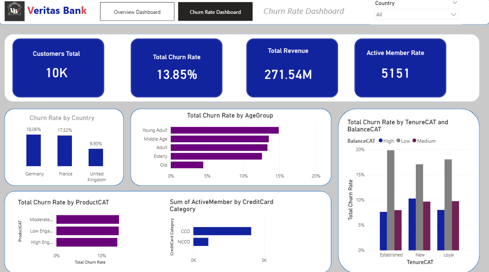

# Customer Churn Analysis & Retention Decision Support

## Research & Applied Analytics Project

### Abstract

This project investigates customer churn using SQL-based data transformation, exploratory analysis, and Power BI visualisation, with the objective of identifying patterns associated with customer retention and developing data-driven strategies to support customer relationship management.

The project involved leading approximately **85% of the customer churn analysis, SQL transformation, Power BI dashboard development, and retention strategy analysis** for Veritas Bank.

The analysis focused on understanding customer behaviour and identifying patterns that could support targeted retention interventions.

Beyond the immediate business analytics objective, the project provides a foundation for further investigation into predictive modelling, machine learning, customer behaviour modelling, and intelligent decision-support systems.

**Research areas:** Machine Learning · Predictive Analytics · Customer Behaviour Analytics · Data Mining · Decision Support · Explainable AI

---

# 1. Introduction

Customer retention is an important challenge for organisations operating in competitive financial markets.

Large customer datasets can contain behavioural patterns that may provide useful information about customer engagement, retention, and potential churn.

Traditional reporting can identify historical churn rates, but advanced analytics provides an opportunity to investigate why customers leave and whether customers at increased risk of churn can be identified before they leave.

This project investigates customer churn using structured data analysis and business intelligence techniques, while considering how the work could be extended towards predictive customer-retention systems.

---

# 2. Problem Statement

Customer churn can negatively affect revenue, customer lifetime value, and long-term business performance.

A key challenge for organisations is identifying customers who may be at increased risk of leaving and understanding the factors associated with their behaviour.

The problem addressed by this project is:

> **How can customer data be analysed to identify churn patterns and support data-driven customer-retention strategies?**

A further research question arising from the project is whether machine-learning techniques could be used to predict customer churn before it occurs.

---

# 3. Research Motivation

The project was motivated by the need to move beyond simply measuring historical churn.

Traditional analysis can answer:

> **How many customers have left?**

More detailed analytics can investigate:

> **Which customers are leaving?**

and:

> **What characteristics or behaviours are associated with churn?**

Predictive analytics can potentially go further:

> **Which existing customers are likely to churn?**

This progression creates an opportunity to develop intelligent customer-retention decision-support systems.

---

# 4. Project Objectives

The objectives of the project were to:

1. Analyse customer data using SQL.
2. Transform and prepare data for analysis.
3. Investigate customer churn patterns.
4. Identify characteristics associated with customer retention and churn.
5. Develop interactive Power BI dashboards.
6. Communicate customer behaviour patterns to stakeholders.
7. Develop data-driven customer-retention recommendations.
8. Identify opportunities for future predictive churn modelling.

---

# 5. Analytical Approach

The project followed a structured analytical workflow:

**Customer Data**

↓

**Data Preparation**

↓

**SQL Transformation**

↓

**Exploratory Data Analysis**

↓

**Churn Analysis**

↓

**Customer Behaviour Analysis**

↓

**Power BI Visualisation**

↓

**Retention Strategy**

↓

**Potential Predictive Analytics Extension**

The workflow combined data transformation, analytical investigation, visualisation, and business interpretation.

---

# 6. Data Preparation and SQL Transformation

SQL was used to transform and prepare the customer data for analysis.

Data preparation is an important stage of customer analytics because inconsistencies, missing information, incorrect data types, and duplicated records can affect analytical results.

The transformation stage prepared the data for subsequent analysis and dashboard development.

The SQL workflow provided a structured analytical dataset that could be used to investigate customer behaviour and churn.

---

# 7. Customer Churn Analysis

The analysis examined customer churn patterns to understand the characteristics and behaviour of customers who had left the organisation.

The analysis considered customer-level information and churn-related indicators to identify patterns that could inform retention strategies.

The objective was not simply to calculate a churn percentage, but to understand the underlying customer patterns that could potentially be addressed through targeted interventions.

---

# 8. Churn Dashboard

The Power BI dashboard was developed to provide an interactive view of customer churn and related customer characteristics.

## Churn Analysis Dashboard

The dashboard provides a visual representation of customer churn patterns and supports exploration of customer characteristics associated with retention and churn.

---

# 9. Customer Retention Analysis

Customer retention requires more than identifying customers who have already left.

The analysis therefore considered how customer characteristics and behavioural patterns could be used to inform retention strategies.

Potential retention interventions can be designed around customer segments rather than applying identical strategies to every customer.

This creates an opportunity for organisations to develop more targeted customer-management strategies.

---

# 10. Detailed Churn Analysis

A second analytical dashboard was developed to provide a more detailed view of churn-related patterns.

## Detailed Churn Dashboard

The dashboard supports deeper exploration of customer churn and provides a basis for interpreting customer behaviour patterns.

---

# 11. Data-Driven Retention Strategy

The analysis was used to support the development of data-driven customer-retention strategies.

Rather than treating the customer base as a single population, customer characteristics and behaviour can be used to identify groups that may require different retention approaches.

Potential strategic approaches include:

- Targeted customer engagement
- Personalised retention campaigns
- Identification of high-value customers
- Early intervention for customers showing risk indicators
- Improved customer segmentation
- Monitoring of changing customer behaviour

The appropriate intervention would depend on the characteristics of each customer group.

---

# 12. From Descriptive Churn Analysis to Predictive Analytics

The current project primarily focuses on analysing historical customer churn.

A natural extension is to investigate whether customer data can be used to predict future churn.

The progression can be represented as:

**Historical Customer Data**

↓

**Descriptive Churn Analysis**

↓

**Customer Behaviour Analysis**

↓

**Predictive Churn Model**

↓

**Churn Risk Score**

↓

**Targeted Retention Intervention**

This would allow organisations to move from reacting to customer churn towards proactively identifying customers who may require intervention.

---

# 13. Proposed Predictive Churn Model

A future research extension could investigate the development of a machine-learning model capable of estimating the probability that a customer will churn.

A conceptual system could operate as follows:

**Customer Data**

↓

**Feature Engineering**

↓

**Machine Learning Model**

↓

**Churn Probability**

↓

**Low / Medium / High Risk**

↓

**Retention Recommendation**

Potential input variables would need to be determined from the available dataset and validated through empirical analysis.

---

# 14. Potential Machine Learning Approaches

If suitable historical labelled data is available, potential predictive models could include:

- Logistic Regression
- Decision Trees
- Random Forest
- Gradient Boosting
- XGBoost

The objective would be to compare model performance and determine which approach provides an appropriate balance between predictive performance and interpretability.

---

# 15. Model Evaluation

A future predictive study would require appropriate evaluation procedures.

Potential evaluation metrics include:

- Accuracy
- Precision
- Recall
- F1-score
- ROC-AUC
- Confusion Matrix

Because churn prediction can involve an imbalance between customers who churn and customers who remain, evaluation should not rely exclusively on accuracy.

Precision and recall could be particularly important when evaluating the ability of a system to identify customers at risk of churn.

---

# 16. Explainable AI Extension

Predicting customer churn is only one component of an effective decision-support system.

A business user may also need to understand:

> **Why is this customer considered to be at risk of churn?**

Explainable AI could therefore provide an important extension to this project.

For example, a future system could present:

**Customer Churn Risk: HIGH**

**Potential contributing factors:**

- Factor A
- Factor B
- Factor C

**Suggested action:**

Targeted retention intervention

Techniques such as SHAP could potentially be investigated to provide explanations for individual model predictions.

---

# 17. Proposed Research Questions

The project provides several possible directions for future research.

### Research Question 1

> **Can customer behavioural data be used to predict the probability of customer churn?**

### Research Question 2

> **Which customer characteristics and behavioural patterns contribute most significantly to churn risk?**

### Research Question 3

> **Can explainable machine-learning models provide useful information for customer-retention decisions?**

### Research Question 4

> **Can predictive churn analytics improve the effectiveness of targeted customer-retention strategies?**

---

# 18. Proposed Research Hypotheses

A potential future study could investigate:

> **H1: Machine-learning models can predict customer churn using historical customer behavioural data.**

A second hypothesis could investigate explainability:

> **H2: Explainable machine-learning models can identify customer characteristics that provide useful information for retention decision-making.**

A third hypothesis could investigate intervention:

> **H3: Predictive churn analytics can improve the effectiveness of targeted customer-retention strategies compared with conventional customer-management approaches.**

These hypotheses would require empirical testing.

---

# 19. Potential Experimental Design

A future research study could follow this structure:

**Historical Customer Data**

↓

**Data Cleaning**

↓

**Feature Engineering**

↓

**Training / Validation / Test Split**

↓

**Baseline Model**

↓

**Machine Learning Models**

↓

**Model Evaluation**

↓

**Explainability Analysis**

↓

**Customer Risk Segmentation**

↓

**Retention Strategy**

↓

**Evaluation of Outcomes**

The baseline model would provide a reference point against which more advanced models could be compared.

---

# 20. Human-Centred Decision Support

A predictive churn system should not necessarily replace the judgement of customer relationship teams.

Instead, the system could provide decision support.

For example:

**Customer**

↓

**Churn Risk Assessment**

↓

**Explanation of Risk Factors**

↓

**Recommended Intervention**

↓

**Human Review**

↓

**Retention Action**

This human-in-the-loop approach could help organisations combine machine-learning predictions with customer-service knowledge and organisational policies.

---

# 21. Potential Research Architecture

A future implementation could consist of:

**Customer Data Sources**

↓

**Data Engineering Pipeline**

↓

**Analytical Data Store**

↓

**Machine Learning Model**

↓

**Churn Risk Prediction**

↓

**Explainability Layer**

↓

**Power BI / Decision-Support Interface**

↓

**Customer Retention Team**

Such an architecture could integrate data engineering, machine learning, explainable AI, and business intelligence.

---

# 22. Limitations

The current project has several limitations.

First, the work primarily focused on customer churn analysis, SQL transformation, Power BI visualisation, and retention strategy development.

Second, a machine-learning churn model has not been claimed unless it has actually been trained and evaluated using appropriate historical data.

Third, predictive performance and causal relationships would require further empirical investigation.

Fourth, retention recommendations would need to be evaluated through implementation and measurement before their effectiveness could be established experimentally.

---

# 23. Future Research

Potential future research directions include:

1. Predictive customer churn modelling
2. Customer lifetime-value prediction
3. Behavioural customer segmentation
4. Explainable AI for retention decisions
5. Personalised retention recommendations
6. Customer next-best-action systems
7. Real-time churn-risk monitoring
8. Human-AI customer-management systems
9. Fairness and bias in customer-risk prediction
10. Evaluation of AI-assisted retention strategies

---

# 24. Research Significance

This project demonstrates how practical customer analytics can provide a foundation for more advanced research in predictive analytics and intelligent decision support.

The work connects business intelligence with research areas including:

- Machine Learning
- Predictive Analytics
- Data Mining
- Customer Behaviour Analytics
- Explainable AI
- Decision Support
- Intelligent Systems

The project provides a practical pathway from descriptive customer analytics towards predictive and intelligent customer-retention systems.

---

# 25. Technologies

The completed project involved:

- SQL
- Power BI
- Data Transformation
- Data Analysis
- Customer Churn Analysis
- Business Intelligence
- Data Visualisation
- Retention Strategy Development

Future predictive extensions could investigate Python and appropriate machine-learning frameworks.

---

# 26. Project Contribution

The project demonstrates practical experience in transforming customer data into analytical insights and communicating those insights through interactive business-intelligence dashboards.

Approximately **85% of the customer churn analysis, SQL transformation, Power BI dashboard development, and retention strategy analysis** was led as part of the project.

The work also demonstrates how an applied industry analytics project can generate research questions around predictive modelling, explainable AI, and intelligent decision support.

---

# 27. Project Status

**Current status:** Applied customer analytics project with proposed predictive modelling, explainable AI, and intelligent customer-retention extensions.

The published project documents the analytical work completed to date while identifying potential directions for future empirical research.
