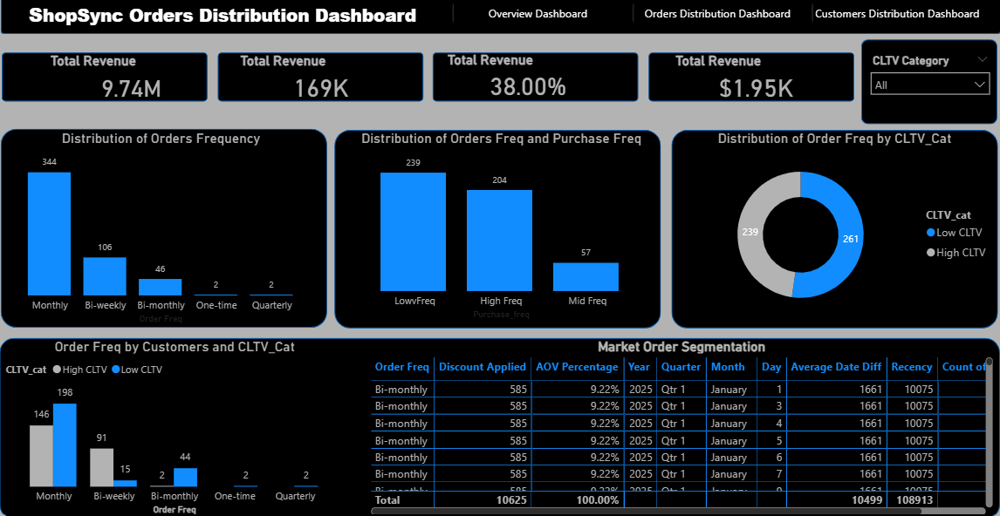

# Customer Segmentation & Sales Strategy Optimisation

## Research & Applied Analytics Project

### Abstract

This project investigates how customer segmentation and behavioural analysis can be used to improve customer engagement, retention, and purchase frequency within an e-commerce environment.

The project analysed customer and sales information to identify meaningful customer groups and develop strategies aimed at improving retention and purchase behaviour.

The analysis identified strategies targeting up to **15% potential revenue growth** through improved customer segmentation and more targeted sales strategies.

Beyond the immediate business objective, the project provides a foundation for further investigation into customer behaviour modelling, predictive analytics, recommender systems, machine learning, and intelligent marketing decision support.

**Research areas:** Customer Segmentation · Machine Learning · Predictive Analytics · Data Mining · Recommender Systems · Intelligent Decision Support

---

# 1. Introduction

E-commerce organisations generate large volumes of customer and transaction data.

This data can provide valuable information about purchasing behaviour, customer preferences, engagement, and purchasing frequency.

However, treating all customers in the same way can result in inefficient marketing and sales strategies.

Customer segmentation provides a mechanism for identifying groups of customers with similar characteristics or behaviours and developing strategies that are more appropriate for each group.

This project investigates customer segmentation as a basis for improving retention, purchase frequency, and sales strategy.

---

# 2. Problem Statement

Customers do not necessarily have identical purchasing behaviours.

Some customers may purchase frequently, while others may purchase occasionally. Some may generate significant revenue, while others may be less engaged.

Applying the same sales strategy to all customers may therefore limit the effectiveness of customer engagement activities.

The problem addressed by this project is:

> **How can customer data be analysed to identify meaningful customer segments and develop targeted strategies that improve retention and purchase frequency?**

A further research direction is whether machine-learning models can automatically identify customer segments and predict the most appropriate action for each customer group.

---

# 3. Research Motivation

The project was motivated by the need to move from broad customer marketing towards data-driven customer segmentation.

Traditional sales analysis can answer:

> **What products are being purchased?**

Customer segmentation can investigate:

> **Who is purchasing?**

Behavioural analytics can investigate:

> **How are different customer groups behaving?**

Predictive analytics could potentially answer:

> **What is each customer likely to purchase or do next?**

This creates an opportunity to investigate intelligent customer decision-support and recommendation systems.

---

# 4. Project Objectives

The objectives of the project were to:

1. Analyse customer and sales information.
2. Identify meaningful customer segments.
3. Examine customer purchasing behaviour.
4. Investigate differences between customer groups.
5. Identify opportunities to improve customer retention.
6. Identify opportunities to increase purchase frequency.
7. Develop targeted sales strategies.
8. Estimate potential revenue opportunities associated with improved segmentation.
9. Identify potential extensions into predictive analytics and intelligent recommendation systems.

---

# 5. Analytical Approach

The project followed a structured analytical process:

**Customer & Transaction Data**

↓

**Data Preparation**

↓

**Exploratory Analysis**

↓

**Customer Behaviour Analysis**

↓

**Customer Segmentation**

↓

**Segment Profiling**

↓

**Sales Strategy Development**

↓

**Potential Revenue Opportunity**

↓

**Predictive Analytics Extension**

---

# 6. Customer Behaviour Analysis

Customer behaviour was examined to identify differences in purchasing patterns across the customer base.

Understanding customer behaviour is important because customer groups may differ in:

- Purchase frequency
- Spending behaviour
- Engagement
- Product preferences
- Retention behaviour
- Customer value

These differences can provide a basis for developing more targeted customer strategies.

---

# 7. Customer Segmentation

Customer segmentation was used to divide the customer population into groups with similar characteristics or behaviours.

Rather than applying a single strategy to all customers, segmentation provides an opportunity to develop differentiated approaches.

For example, different customer groups could potentially require:

- Retention-focused strategies
- Cross-selling strategies
- Upselling strategies
- Re-engagement campaigns
- Loyalty incentives
- Personalised recommendations

The appropriate strategy would depend on the characteristics of each segment.

---

# 8. Segmentation Dashboard

The project included dashboard-based analysis to support interpretation of customer segments and sales behaviour.

## Customer Segmentation Dashboard

The dashboard provides a visual representation of customer and sales patterns and supports exploration of differences between customer groups.

---

# 9. Customer Segment Analysis

Customer segments were analysed to identify opportunities for improving customer engagement and purchase frequency.

Segment-level analysis can help answer questions such as:

- Which customers purchase most frequently?
- Which customer groups have lower engagement?
- Which segments represent higher-value customers?
- Which segments may benefit from re-engagement?
- Which customers could potentially respond to cross-selling?
- Which groups may benefit from loyalty strategies?

These questions provide a foundation for targeted customer strategies.

---

# 10. Sales Strategy Development

The analysis was used to identify strategies aimed at improving customer retention and purchase frequency.

Potential approaches included:

### Retention

Identify customers or segments that may require additional engagement.

### Cross-Selling

Identify opportunities to introduce customers to related products.

### Upselling

Identify opportunities to encourage customers to purchase higher-value products.

### Re-Engagement

Develop targeted strategies for customers showing reduced purchasing activity.

### Loyalty

Develop strategies designed to encourage repeat purchasing among engaged customers.

---

# 11. Sales Performance Dashboard

A further dashboard was developed to support analysis of sales and customer behaviour.

## Sales Strategy Dashboard

The dashboard supports analysis of sales patterns and customer behaviour relevant to the development of targeted strategies.

---

# 12. Customer Behaviour & Purchase Frequency

Purchase frequency can provide an important indicator of customer engagement.

A reduction in purchase frequency may represent an opportunity for early intervention.

A future analytical system could therefore monitor changes in customer behaviour over time and identify customers whose purchasing activity is declining.

Conceptually:

**Customer Purchase History**

↓

**Behavioural Analysis**

↓

**Purchase-Frequency Trend**

↓

**Customer Risk / Opportunity**

↓

**Targeted Intervention**

This provides a potential bridge between descriptive customer analytics and predictive decision support.

---

# 13. Potential Revenue Opportunity

The analysis identified strategies targeting up to **15% potential revenue growth** through improved customer segmentation and sales strategy.

This figure represents a targeted potential opportunity based on the analytical recommendations.

It should not be interpreted as an experimentally established revenue increase unless the strategies were implemented and the resulting revenue change was measured.

The distinction is important when presenting the project as research-oriented work.

---

# 14. From Segmentation to Machine Learning

Traditional segmentation can rely on predefined business rules.

Machine learning provides an opportunity to investigate whether customer groups can be identified algorithmically from behavioural data.

A future research extension could investigate clustering techniques such as:

- K-Means
- Hierarchical Clustering
- DBSCAN

The resulting clusters could then be profiled to understand their behavioural characteristics.

---

# 15. Proposed Machine Learning Workflow

A potential research workflow could be:

**Customer Data**

↓

**Data Cleaning**

↓

**Feature Engineering**

↓

**Behavioural Features**

↓

**Clustering Algorithm**

↓

**Customer Clusters**

↓

**Cluster Profiling**

↓

**Business Interpretation**

↓

**Targeted Customer Strategy**

This would allow customer segmentation to be investigated as a reproducible machine-learning problem.

---

# 16. Predictive Customer Behaviour

Segmentation can be extended beyond identifying groups.

A future research direction could investigate whether customer behaviour can be predicted.

Potential prediction tasks could include:

- Predicting future purchase frequency
- Predicting customer churn
- Predicting customer value
- Predicting next purchase category
- Predicting customer response to an offer

These prediction tasks could support more proactive customer-management strategies.

---

# 17. Recommender System Extension

An additional research direction is the development of a recommendation system.

A future system could potentially use customer purchasing history and segment characteristics to recommend relevant products.

Conceptually:

**Customer History**

↓

**Customer Profile**

↓

**Behavioural Similarity**

↓

**Recommendation Model**

↓

**Recommended Products**

↓

**Customer Interaction**

Such a system could investigate how machine learning can support personalised e-commerce experiences.

---

# 18. Proposed Research Questions

The project provides several potential research questions.

### Research Question 1

> **Can machine-learning techniques identify meaningful customer segments from behavioural and transaction data?**

### Research Question 2

> **Which customer characteristics are most useful for predicting purchase frequency?**

### Research Question 3

> **Can predictive customer analytics improve the effectiveness of targeted sales strategies?**

### Research Question 4

> **Can customer segmentation be combined with recommendation systems to improve personalised product recommendations?**

---

# 19. Proposed Research Hypotheses

A potential future study could investigate:

> **H1: Machine-learning-based customer segmentation can identify behaviourally meaningful customer groups.**

A second hypothesis could investigate purchase behaviour:

> **H2: Customer behavioural features can be used to predict future purchase frequency.**

A further hypothesis could investigate personalised strategies:

> **H3: Customer-segment-based interventions can improve customer engagement compared with non-segmented sales strategies.**

Another potential hypothesis could investigate recommendations:

> **H4: Personalised recommendations based on customer behavioural patterns can improve purchase engagement.**

These hypotheses would require empirical testing.

---

# 20. Potential Experimental Design

A future research study could follow this structure:

**Customer & Transaction Data**

↓

**Data Cleaning**

↓

**Feature Engineering**

↓

**Customer Behaviour Features**

↓

**Segmentation Model**

↓

**Cluster Evaluation**

↓

**Customer Segment Profiling**

↓

**Predictive Model**

↓

**Recommendation / Decision-Support System**

↓

**Experimental Evaluation**

This approach would allow the analytical and machine-learning components to be evaluated systematically.

---

# 21. Segment Evaluation

A machine-learning segmentation approach would require appropriate evaluation.

Potential clustering evaluation techniques could include:

- Silhouette Score
- Davies-Bouldin Index
- Cluster stability analysis
- Business interpretability

However, technical clustering quality alone would not establish whether the segments are useful from a business perspective.

The resulting segments would also need to be evaluated according to their practical usefulness and stability.

---

# 22. Explainable Customer Analytics

An intelligent customer system should provide understandable reasons for its recommendations.

For example:

**Customer Segment: High-Value Repeat Customer**

**Observed characteristics:**

- High purchase frequency
- Strong engagement
- Repeat purchasing behaviour

**Potential strategy:**

Cross-sell complementary products

This type of explanation could help business users understand why a particular strategy is being recommended.

---

# 23. Human-AI Decision Support

The purpose of an intelligent customer system would not necessarily be to replace marketing or sales professionals.

Instead, the system could support their decision-making.

A conceptual workflow could be:

**Customer Data**

↓

**AI / Analytics System**

↓

**Customer Segment**

↓

**Predicted Behaviour**

↓

**Recommended Action**

↓

**Human Review**

↓

**Customer Engagement**

This human-in-the-loop approach could combine automated analysis with business expertise.

---

# 24. Potential Research Architecture

A future implementation could consist of:

**Customer Data Sources**

↓

**Data Engineering Pipeline**

↓

**Analytical Data Store**

↓

**Customer Segmentation Model**

↓

**Predictive Analytics**

↓

**Recommendation Engine**

↓

**Decision-Support Dashboard**

↓

**Sales / Marketing Team**

This architecture could integrate data engineering, machine learning, predictive analytics, recommendation systems, and business intelligence.

---

# 25. Limitations

The current project has several limitations.

First, the completed work focused primarily on customer segmentation, behavioural analysis, and development of sales strategies.

Second, a machine-learning clustering model should not be claimed unless it has actually been implemented and evaluated.

Third, the potential revenue opportunity of up to 15% should not be presented as an achieved revenue increase unless the recommended strategies were implemented and measured.

Fourth, predictive customer behaviour and recommendation systems represent future research extensions rather than completed components of the current project.

---

# 26. Future Research

Potential future research directions include:

1. Machine-learning customer segmentation
2. Customer churn prediction
3. Purchase-frequency prediction
4. Customer lifetime-value prediction
5. Personalised recommendation systems
6. Next-best-action systems
7. Customer behavioural modelling
8. Explainable AI for customer analytics
9. Real-time customer segmentation
10. Human-AI sales decision support

---

# 27. Research Significance

This project demonstrates how customer and sales analytics can provide a foundation for intelligent customer-management systems.

The work connects practical business analytics with research areas including:

- Machine Learning
- Customer Behaviour Analytics
- Data Mining
- Predictive Analytics
- Recommendation Systems
- Explainable AI
- Intelligent Decision Support

The project provides a pathway from descriptive customer segmentation towards predictive and personalised customer decision-support systems.

---

# 28. Technologies

The completed project involved:

- Data Analysis
- Customer Segmentation
- Business Intelligence
- Data Visualisation
- Sales Analysis
- Customer Behaviour Analysis
- Strategic Analytics

Future research extensions could investigate Python, SQL, machine-learning frameworks, clustering algorithms, and recommendation-system technologies.

---

# 29. Project Contribution

The project demonstrates practical experience in using customer and sales information to identify behavioural patterns and develop targeted strategies.

The analysis identified opportunities targeting up to **15% potential revenue growth** through improved customer segmentation and sales strategy.

The work also provides a foundation for further research into machine-learning-based segmentation, predictive customer analytics, recommendation systems, and intelligent decision support.

---

# 30. Project Status

**Current status:** Applied customer analytics and segmentation project with proposed machine-learning, predictive analytics, recommendation-system, and intelligent decision-support extensions.

The published project documents the analytical work completed to date while identifying potential directions for future empirical research.
